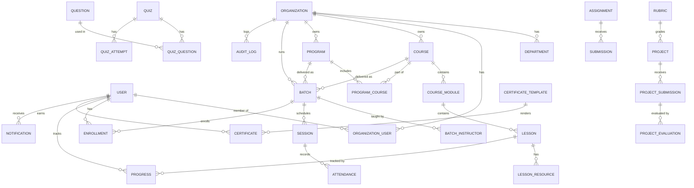

# Database design (V1)

Source of truth: [`apps/api/prisma/schema.prisma`](../../../apps/api/prisma/schema.prisma) — Prisma 7, PostgreSQL 16.

## Conventions

- UUID primary keys; table names snake_case via `@@map`.
- Every organization-owned table has `organizationId` (indexed).
- Child tables that are always reached through a scoped parent (modules, lessons,
  sessions, quiz_questions, program_courses, batch_instructors, project_evaluations)
  inherit the parent's organization instead of repeating the column.
- Snapshots on certificates (`recipientName`, `title`) so reissued names/course renames never change an issued certificate.
- Quiz `correctAnswer` is never returned by learner-facing endpoints.
- Extra constraints added in raw SQL migrations:
  - `enrollments`: CHECK exactly one of `course_id` / `program_id` is set.
  - `batches`: CHECK at least one of `program_id` / `course_id` is set.
  - `attendance`, `submissions`, `quiz_attempts`: `organization_id` must equal parent's (enforced by service layer + tests).

## Entity overview

## Deferred to V2+ (not in schema yet)

devices / device_credentials / device_telemetry, labs / experiments / lab_submissions,
payments, internships, community. Lesson type `LAB` is reserved so the content model doesn't change.
